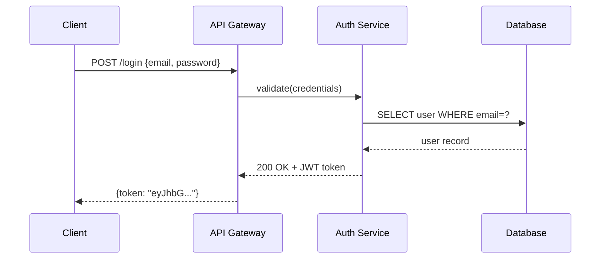
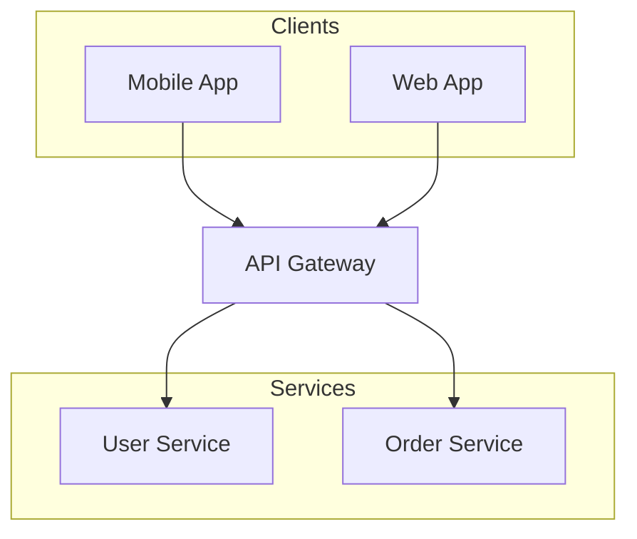

# Beautiful Mermaid Renderer

将 Mermaid 代码渲染为高质量 PNG 图片，使用 beautiful-mermaid（美观主题）+ agent-browser（浏览器截图）技术栈。

## 支持的图表类型

| 类型 | 关键字 | 用途 |
|------|--------|------|
| 流程图 | `graph TD` / `flowchart LR` | 流程、决策、管道 |
| 时序图 | `sequenceDiagram` | API 调用、消息传递 |
| 状态图 | `stateDiagram-v2` | 状态机、生命周期 |
| 类图 | `classDiagram` | OOP 模型、数据结构 |
| ER 图 | `erDiagram` | 数据库表结构 |
| XY 图表 | `xychart-beta` | 柱状图、折线图 |

## 前置依赖

首次使用前，需在 skill 目录安装依赖（只需一次）：

```bash
cd <skill-dir>
npm install
agent-browser install   # 下载 Chrome（如系统已有 Chrome 可跳过）
```

**环境要求：**
- Node.js 18+
- Chrome 浏览器（系统已安装即可，agent-browser 会自动检测）
- 网络连接（首次安装依赖时）

## 快速开始

### 基本用法

```bash
# 从 .mmd 文件渲染
node <skill-dir>/scripts/render.mjs diagram.mmd

# 指定输出路径和主题
node <skill-dir>/scripts/render.mjs diagram.mmd -o output.png -t catppuccin-mocha

# 从 stdin 读取
echo "graph TD; A-->B; B-->C" | node <skill-dir>/scripts/render.mjs -o flow.png
```

### 从 Markdown 代码块渲染

脚本自动识别 ```mermaid 代码块，也接受纯 mermaid 代码：

```bash
# 从包含 mermaid 代码块的 markdown 文件提取并渲染
cat README.md | node <skill-dir>/scripts/render.mjs -o diagram.png
```

## 命令行选项

```
node scripts/render.mjs <input.mmd> [options]

选项：
  -o, --output <path>      输出 PNG 路径（默认：与输入同名 .png）
  -t, --theme <name>       主题（默认：tokyo-night）
  -w, --width <px>         视口宽度（默认：1200）
  -s, --scale <n>          像素比（默认：2，高清）
  --bg <color>             背景色（覆盖主题，如 #ffffff）
  --fg <color>             前景色（覆盖主题）
  --transparent            透明背景
  --keep-html              保留中间 HTML 文件（调试用）
```

## 内置主题

| 主题 | 类型 | 背景 | 适合场景 |
|------|------|------|---------|
| `tokyo-night` | 暗色 | `#1a1b26` | 技术文档、开发场景 |
| `catppuccin-mocha` | 暗色 | `#1e1e2e` | 柔和美观 |
| `dracula` | 暗色 | `#282a36` | 经典暗色 |
| `github-dark` | 暗色 | `#0d1117` | GitHub 风格 |
| `nord` | 暗色 | `#2e3440` | 北欧极简 |
| `zinc-light` | 亮色 | `#FFFFFF` | 正式文档 |
| `github-light` | 亮色 | `#ffffff` | GitHub 风格 |
| `catppuccin-latte` | 亮色 | `#eff1f5` | 柔和亮色 |
| `solarized-light` | 亮色 | `#fdf6e3` | 护眼亮色 |

完整主题列表：`zinc-light`, `zinc-dark`, `tokyo-night`, `tokyo-night-storm`, `tokyo-night-light`, `catppuccin-mocha`, `catppuccin-latte`, `nord`, `nord-light`, `dracula`, `github-light`, `github-dark`, `solarized-light`, `solarized-dark`, `one-dark`

## 工作原理

```
Mermaid 代码
    │
    ▼
beautiful-mermaid ──→ SVG 字符串（同步渲染，15+ 主题）
    │
    ▼
HTML 包装器 ──→ 完整 HTML 页面（含背景色、布局）
    │
    ▼
agent-browser ──→ 打开 HTML + 截图 PNG（Chrome headless）
    │
    ▼
PNG 输出（高清，2x 像素比）
```

**为什么选择这个技术栈：**
- **beautiful-mermaid**：比标准 mermaid 渲染更美观，15+ 内置主题，同步渲染无需 DOM 依赖
- **agent-browser**：Vercel Labs 出品，专为 AI agent 设计的浏览器自动化工具，截图质量高
- **组合优势**：SVG 矢量渲染 + 浏览器截图 = 保留所有 CSS 特性的高质量 PNG

## 常见问题

| 问题 | 解决方案 |
|------|---------|
| `agent-browser` 未找到 | 运行 `cd <skill-dir> && npm install agent-browser` |
| Chrome 未安装 | 运行 `agent-browser install` 或安装系统 Chrome |
| 渲染语法错误 | 检查 mermaid 语法，参考 [reference/syntax.md](reference/syntax.md) |
| PNG 空白或太小 | 增加 `--width 1600` 或 `--scale 3` |
| 中文显示异常 | 确保系统已安装中文字体 |
| 截图超时 | 检查 Chrome 是否正常运行，尝试 `agent-browser doctor` |

## 示例

### 示例 1：用户认证流程

**输入 (auth-flow.mmd)：**


**命令：**
```bash
node scripts/render.mjs auth-flow.mmd -o auth-flow.png -t tokyo-night
```

### 示例 2：微服务架构

**输入 (arch.mmd)：**


**命令：**
```bash
node scripts/render.mjs arch.mmd -o arch.png -t github-dark --scale 3
```

### 示例 3：透明背景输出

```bash
node scripts/render.mjs diagram.mmd -o diagram.png --transparent
```

## 语法参考

详见 [reference/syntax.md](reference/syntax.md) 获取完整的 Mermaid 语法速查表。
