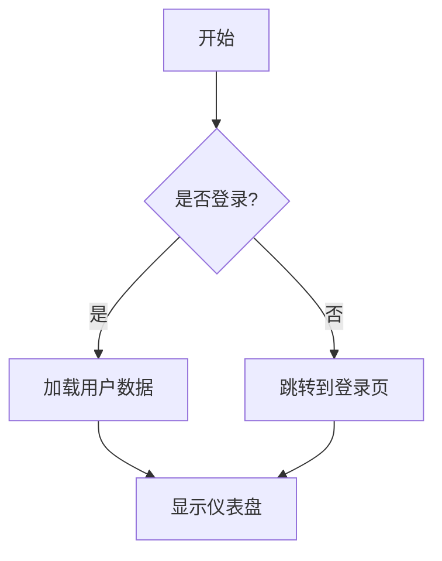
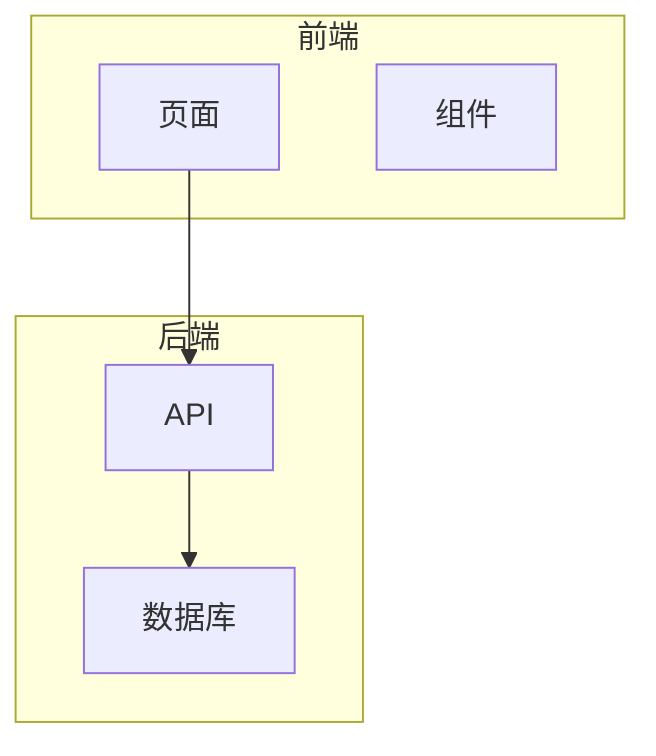
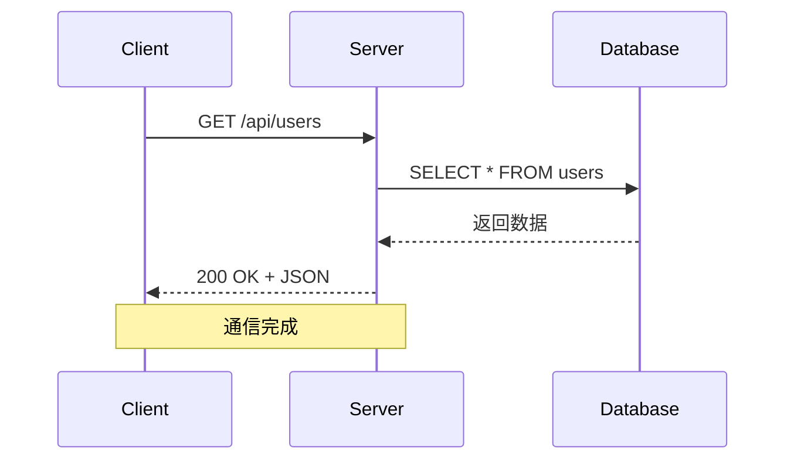
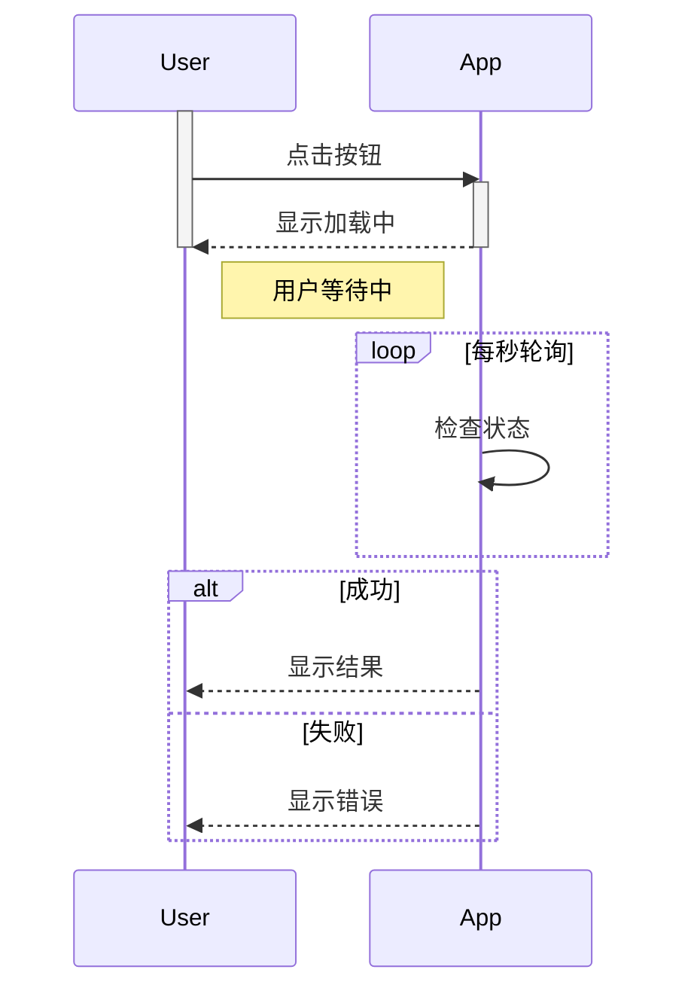
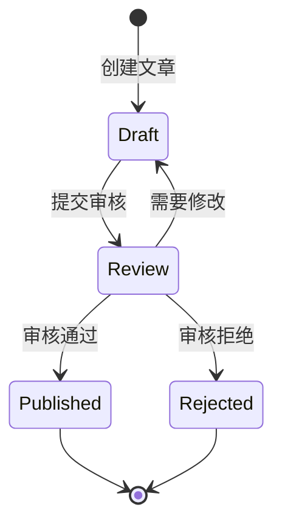
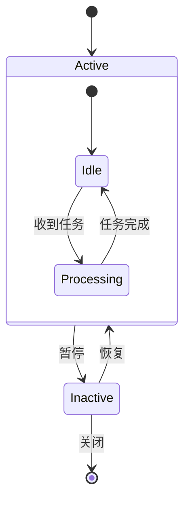
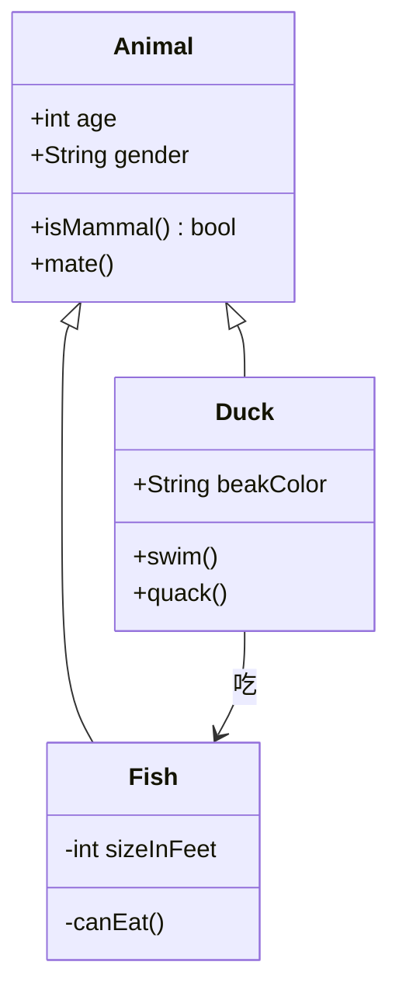
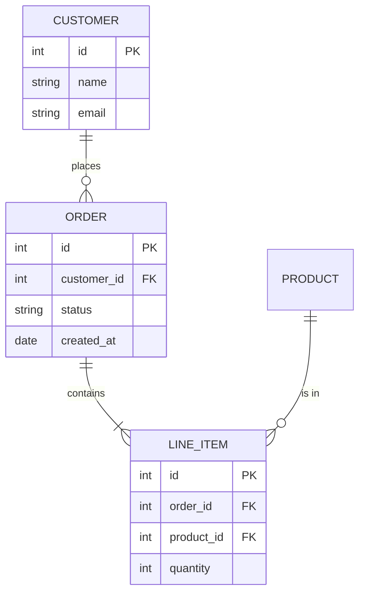
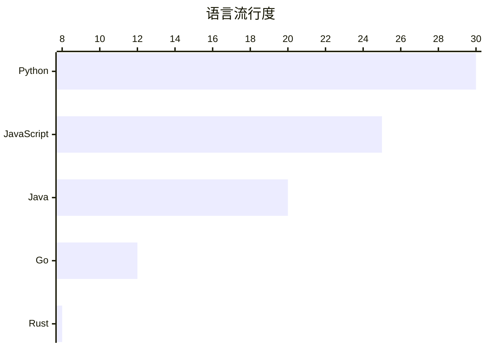

# Mermaid 语法速查表

beautiful-mermaid 支持的 6 种图表类型语法参考。

## 流程图 (Flowchart)



**方向：**
- `TD` / `TB` - 从上到下（默认）
- `LR` - 从左到右
- `BT` - 从下到上
- `RL` - 从右到左

**节点形状：**

| 语法 | 形状 | 示例 |
|------|------|------|
| `A[文本]` | 矩形 | `A[处理数据]` |
| `A(文本)` | 圆角矩形 | `A(开始)` |
| `A{文本}` | 菱形（决策） | `B{是否成功?}` |
| `A([文本])` | 胶囊形 | `A([初始化])` |
| `A((文本))` | 圆形 | `A((数据库))` |
| `A>文本]` | 旗帜形 | `A>重要提示]` |
| `A[(文本)]` | 数据库圆柱 | `A[(Redis)]` |
| `A{{文本}}` | 六边形 | `A{{配置}}` |

**连接线：**

| 语法 | 说明 |
|------|------|
| `A --> B` | 实线箭头 |
| `A --- B` | 实线无箭头 |
| `A -->\|标签\| B` | 带标签箭头 |
| `A -.-> B` | 虚线箭头 |
| `A ==> B` | 粗线箭头 |
| `A --x B` | 带叉箭头 |

**子图：**


---

## 时序图 (Sequence Diagram)



**消息类型：**

| 语法 | 线型 | 说明 |
|------|------|------|
| `A->>B` | 实线箭头 | 同步请求 |
| `A-->>B` | 虚线箭头 | 异步响应 |
| `A--xB` | 实线叉号 | 请求失败 |
| `A--xB` | 虚线叉号 | 响应失败 |
| `A-)B` | 实线开口箭头 | 异步发送 |

**高级特性：**


---

## 状态图 (State Diagram)



**复合状态：**


---

## 类图 (Class Diagram)



**关系类型：**

| 语法 | 说明 |
|------|------|
| `A <\|-- B` | 继承（B 继承 A） |
| `A *-- B` | 组合 |
| `A o-- B` | 聚合 |
| `A --> B` | 关联 |
| `A -- B` | 实线连接 |
| `A ..> B` | 虚线依赖 |
| `A ..\|> B` | 实现 |

**可见性：**
- `+` public
- `-` private
- `#` protected
- `~` package

---

## ER 图 (Entity Relationship)



**关系基数：**

| 语法 | 说明 |
|------|------|
| `\|o--o\|` | 0或1 对 0或1 |
| `\|\|--o\|` | 1或多次 对 0或1 |
| `\|\|--\|\|` | 1或多次 对 1或多次 |
| `}o--o{` | 0或多次 对 0或多次 |
| `}\|--\|{` | 1或多次 对 1或多次 |

**属性标记：**
- `PK` - 主键
- `FK` - 外键
- `UK` - 唯一键

---

## XY 图表 (XY Chart)

### 柱状图

```mermaid
xychart-beta
    title "月度收入"
    x-axis [一月, 二月, 三月, 四月, 五月, 六月]
    y-axis "收入 ($K)" 0 --> 500
    bar [180, 250, 310, 280, 350, 420]
```

### 折线图

```mermaid
xychart-beta
    title "用户增长"
    x-axis [Jan, Feb, Mar, Apr, May, Jun]
    line [1200, 1800, 2500, 3100, 3800, 4500]
```

### 组合图（柱状+折线）

```mermaid
xychart-beta
    title "销售与趋势"
    x-axis [1月, 2月, 3月, 4月, 5月, 6月]
    bar [300, 380, 280, 450, 350, 520]
    line [300, 330, 320, 353, 352, 395]
```

### 水平柱状图



**轴配置：**
- 分类 x 轴：`x-axis [A, B, C]`
- 数值 x 轴范围：`x-axis 0 --> 100`
- 带标题的轴：`x-axis "类别" [A, B, C]`
- Y 轴范围：`y-axis "数值" 0 --> 100`

---

## 常见语法错误

| 错误 | 修正 |
|------|------|
| 标签含特殊字符未加引号 | `A["标签: 值"]` |
| 时序图箭头用错 | 请求用 `->>`，响应用 `-->>` |
| 未声明 participant | 在顶部添加 `participant X as 名称` |
| 子图名称含空格 | 用引号包裹：`subgraph "我的层"` |
| ER 图关系方向反了 | `A ||--o{ B` 表示 A 对 B 是 1 对多 |
