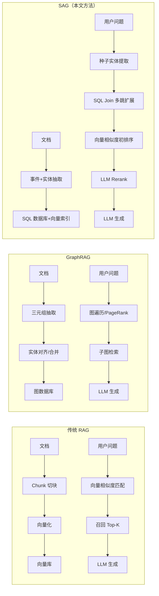
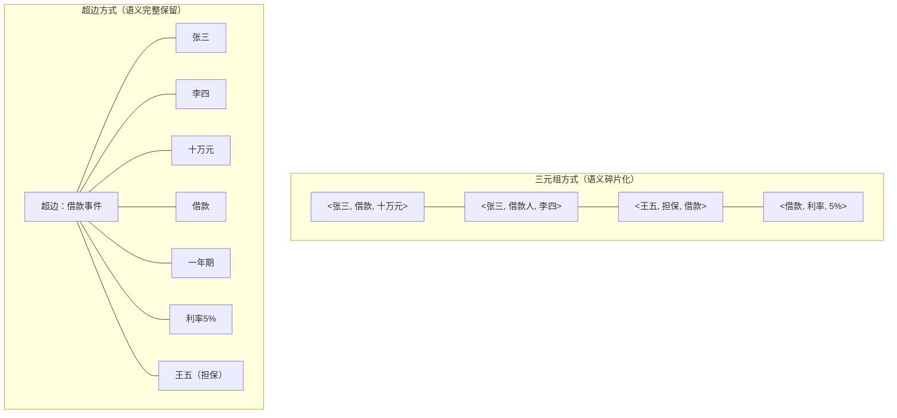
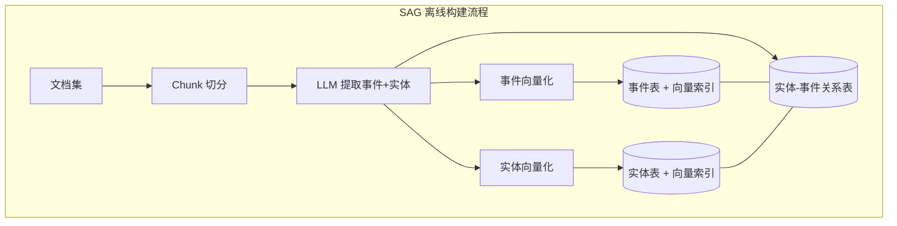
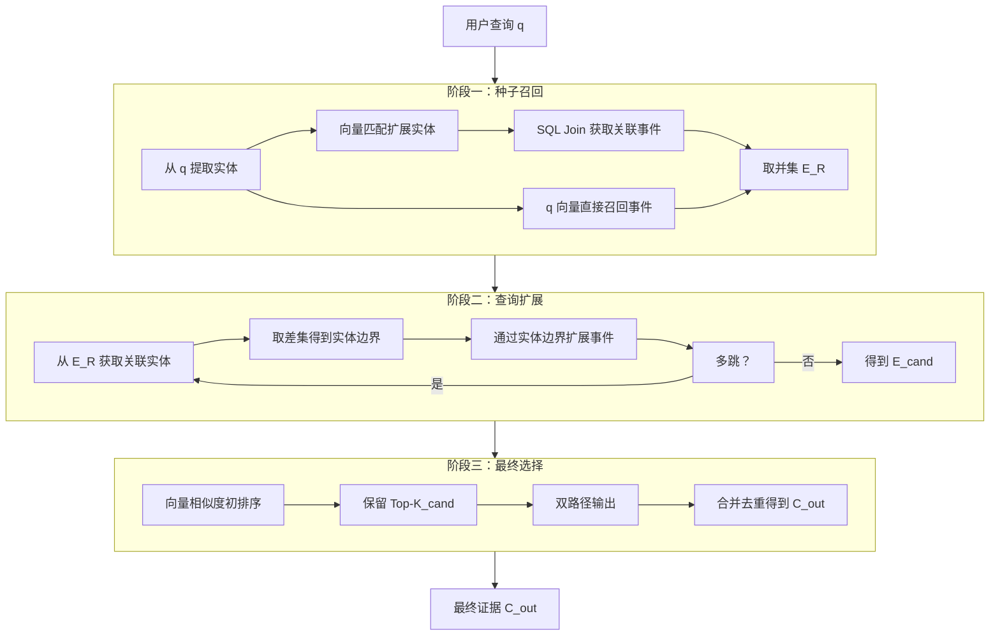
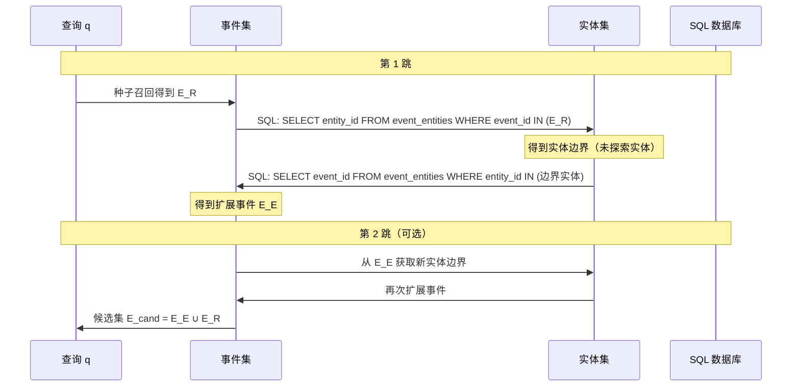
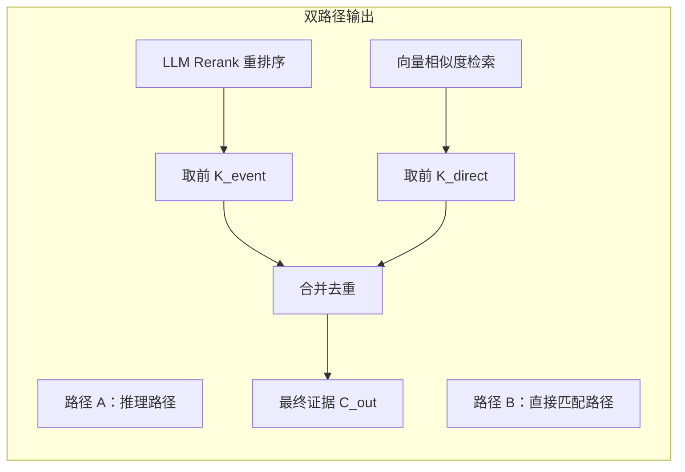
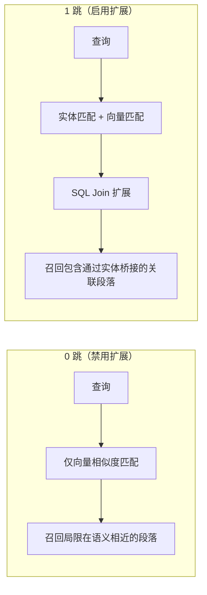
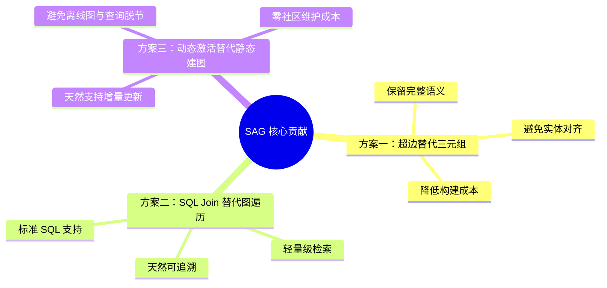
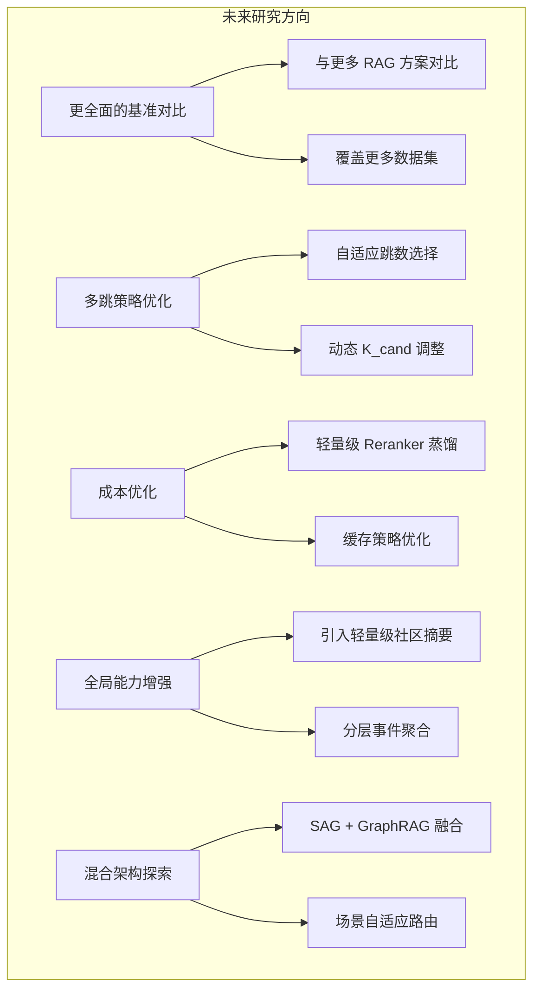

# SAG：用 SQL 动态激活超边的检索增强生成（RAG）

## 一、RAG 的发展脉络

### 1.1 从模型记忆到检索增强

大语言模型本质上是一种记忆结构——它将海量训练语料中的知识压缩为神经网络的参数，推理时根据这些参数生成答案。然而，这种"参数化记忆"存在两个根本性局限：

- **微调成本过高**：如果针对每个知识库都通过微调让模型记住特定知识，训练成本、数据准备成本和版本维护成本都将变得极其高昂，不具备可扩展性。
- **可解释性不足**：模型以"黑盒"方式生成答案，无法向用户展示答案的来源依据，这在需要可信推理的场景（如医疗、法律、金融）中是不可接受的。

因此，**检索增强生成（Retrieval-Augmented Generation, RAG）** 范式应运而生：模型不再依赖参数中记住的知识，而是根据用户问题，从外部知识库中实时检索相关文档片段，再基于这些检索到的证据组织答案。

### 1.2 传统 RAG 的范式与局限

传统 RAG 的流程如下：

```
文档 → 切块（Chunking）→ 向量化（Embedding）→ 向量库
用户问题 → 向量化 → 语义相似度匹配 → 召回 Top-K 块 → LLM 生成答案
```

这种方案在简单的事实性问答场景中表现不错，但一旦涉及**多步推理**，问题就暴露出来：

- **语义匹配的"近视"问题**：向量相似度只能召回与问题"看起来像"的段落，无法跨越多个文档、沿着实体关系链条将分散的证据串联起来。
- **证据链断裂**：一个问题可能需要从文档 A 找到某个实体，再到文档 B 找到该实体的属性，再到文档 C 找到关联事件——传统向量检索无法完成这种多跳推理。
- **信息孤岛**：每个 Chunk 独立存储、独立检索，Chunk 之间丰富的实体关联关系被完全丢弃。

### 1.3 GraphRAG 的尝试及其代价

为解决上述问题，业界提出了 **GraphRAG** 路线——在离线阶段预先构建知识图谱：

1. 从文档中抽取 `<主体, 关系, 客体>` 三元组
2. 对齐实体（Entity Resolution），合并指代同一实体的不同表述
3. 将关系归一化后写入图数据库（如 Neo4j）
4. 查询时对图执行遍历、PageRank 排序、社区检测等操作

GraphRAG 虽然增强了推理能力，但引入了新的问题：

| 问题 | 具体表现 |
|------|----------|
| **建图成本高** | 三元组抽取、实体对齐、关系归一化都需要大量 LLM 调用，处理百万级文档时成本线性增长 |
| **更新维护困难** | 新增文档需要重新评估对全局图的影响，社区结构可能发生变化，增量更新几乎不可行 |
| **LLM 抽取错误传导** | 实体关系抽取一旦出错（如关系类型判断错误），后续的图查询链路会一路错下去，且错误难以追溯 |
| **查询与数据脱节** | 为控制查询延迟，往往限制图遍历的跳数（如 H≤3），导致离线图的信息无法被充分检索 |

### 1.4 SAG 的核心思路

**SAG（SQL-Activated Graph）** 提出了一条中间路线：

> **不提前建图，而是在查询时通过 SQL 动态激活实体与事件之间的超边（Hyperedge），实现多跳推理。**

核心思想可以用一句话概括：**离线只做轻量索引，在线通过 SQL Join 动态构建推理路径。**

下面用一张对比图直观展示三种范式的区别：



## 二、SAG 的设计要点：事件-实体索引与超边

### 2.1 要解决的核心问题

传统三元组抽取的核心缺陷在于**破坏了整体语义**。考虑这样一个事件：

> **张三向李四借款十万元，期限一年，年利率 5%，王五作为担保人。**

如果用三元组来建模，必须拆分为：
- `<张三, 借款, 十万元>`
- `<张三, 借款人, 李四>`
- `<李四, 出借人, 张三>`
- `<王五, 担保, 这笔借款>`
- ...

拆分后，任何一个三元组都无法表达事件的完整含义。更糟糕的是，如果问题问到"张三向谁借了多少钱，谁做了担保"，模型需要在多个三元组之间跳转，任何一个环节出错都导致推理失败。

### 2.2 超边的引入

**超图（Hypergraph）** 的概念在这里就非常自然——超图允许一条边连接任意多个节点，而不是像普通图那样只能连接两个节点。在上述例子中，一条超边就可以同时关联 `张三, 李四, 十万元, 借款, 一年, 5%, 王五` 这七个实体。



### 2.3 SAG 的超边方案

SAG 的超边方案精髓在于：

> **提取事件后，认为事件和事件关联的实体之间存在一条潜在的超边，但**不提前以图的形式存储下来 **，而是在查询时根据实体动态关联事件来激活超边。**

这样做的好处是：
- **语义完整性**：事件保留了 Chunk 的完整语义描述，不会拆分为碎片化的三元组
- **零建图成本**：不需要实体对齐、关系归一化、社区检测等重量级操作
- **动态激活**：超边只在查询时才被"激活"，避免了离线图与查询需求不匹配的问题


## 三、SAG 离线阶段

### 3.1 核心概念

SAG 离线阶段引入两个核心概念：

| 概念 | 定义 | 作用 |
|------|------|------|
| **事件（Event）** | 对一个 Chunk 的核心语义描述，与 Chunk 一一对应 | 保留完整语义，作为 LLM 生成答案时的直接证据 |
| **实体（Entity）** | 事件中出现的具体对象，不具备完整语义信息 | 作为事件的索引和扩展点，连接不同事件 |

实体可以涵盖以下类型：**时间、地点、人物、组织、群体、主题、工作、产品、动作、指标、标签** 等。

### 3.2 核心流程



具体步骤如下：

1. **Chunk 切分**：将文档按段落或固定窗口切分为 Chunk
2. **LLM 分析**：对每个 Chunk，使用 LLM 一次性完成两件事：
   - 总结 Chunk 的核心内容，生成事件描述
   - 提取 Chunk 中出现的所有实体
3. **写入数据库**：
   - **实体表**：存储实体名称及其向量索引，只做简单的文本去重（同名实体合并），不做完整的实体对齐
   - **事件表**：存储事件描述及其向量索引
   - **实体-事件关系表**：记录实体和事件之间的多对多关系（一个事件涉及多个实体，一个实体出现在多个事件中）

### 3.3 数据库表结构示意

```sql
-- 实体表
CREATE TABLE entities (
    id BIGINT PRIMARY KEY,
    name VARCHAR(255),          -- 实体名称
    type VARCHAR(50),           -- 实体类型（人物/组织/时间等）
    embedding VECTOR(1024),     -- 向量索引
    UNIQUE(name)                -- 简单的文本去重
);

-- 事件表
CREATE TABLE events (
    id BIGINT PRIMARY KEY,
    description TEXT,            -- 事件描述（LLM 生成）
    chunk_id VARCHAR(255),       -- 对应的原始 Chunk
    embedding VECTOR(1024)       -- 向量索引
);

-- 实体-事件关系表（多对多）
CREATE TABLE event_entities (
    event_id BIGINT,
    entity_id BIGINT,
    PRIMARY KEY (event_id, entity_id),
    FOREIGN KEY (event_id) REFERENCES events(id),
    FOREIGN KEY (entity_id) REFERENCES entities(id)
);

-- 索引
CREATE INDEX idx_event_entities_entity ON event_entities(entity_id);
CREATE INDEX idx_event_entities_event ON event_entities(event_id);
```

### 3.4 与 GraphRAG 的对比分析

| 维度 | 三元组（GraphRAG） | 超边（SAG） |
|------|-------------------|-------------|
| **语义完整性** | 碎片化，需要多跳拼接 | 完整保留，完全留给 LLM 理解 |
| **关系表达能力** | 强，实体间有明确的关系类型 | 弱，只有连接关系，不表达实体间具体关系 |
| **构建成本** | 很高（实体对齐、关系归一化、社区检测） | 极低（不需要对齐，可并行写入 SQL） |
| **增量更新** | 困难（新增数据影响全局社区结构） | 天然支持（直接追加，不影响已有数据） |
| **推理可解释性** | 高（图遍历路径清晰） | 中（只能说明实体在同一事件中出现） |
| **检索成本** | 图遍历 + PageRank | SQL 索引 Join + 向量检索 |


## 四、SAG 在线检索

SAG 的在线检索分为三个阶段：**种子召回（Seed Recall）→ 查询扩展（Query Expansion）→ 最终选择（Final Selection）**。



### 4.1 种子召回（Seed Recall）

种子召回通过两条路径并行获取初始事件集合：

#### 路径 A：实体引导召回

$$
\mathcal{E}_R^{\text{entity}} = \{ e \mid \exists u \in \hat{\mathcal{U}}_q : \text{SQL-Join}(e, u) \}
$$

- **原始实体种子集 $\mathcal{U}_q$**：从用户查询 $q$ 中直接提取的实体集合
- **扩展实体种子集 $\hat{\mathcal{U}}_q$**：基于向量相似度（默认阈值 0.9），从数据库实体表中匹配到的实体集合。这一步的作用是：用户的查询中可能没有直接提及数据库中的规范实体名称（例如用户说"习大大"而数据库中存的是"习近平"），通过向量匹配可以桥接这种表述差异。
- **种子关联事件 $\mathcal{E}_R^{\text{entity}}$**：使用 SQL 查询 $\hat{\mathcal{U}}_q$ 中的每个实体关联的事件，取并集得到。

#### 路径 B：直接向量召回

$$
\mathcal{E}_R^{\text{direct}}
$$

基于向量相似度（默认阈值 0.4），直接召回与原始查询 $q$ 语义相似的事件。这个阈值比实体匹配的阈值低得多，因为事件描述比实体名称更长、语义更丰富，需要更宽松的匹配条件。

#### 初始回忆集

$$
\mathcal{E}_R = \mathcal{E}_R^{\text{direct}} \cup \mathcal{E}_R^{\text{entity}}
$$

两条路径取并集，确保既有语义直接匹配的证据，又有实体关联的证据。

### 4.2 查询扩展（Query Expansion）

查询扩展是 SAG 实现多跳推理的核心步骤，其本质是**通过实体作为桥梁，在事件之间"跳跃"**。



具体步骤：

1. **获取实体边界**：从 $\mathcal{E}_R$ 出发，查询这些事件关联的所有实体，然后对已经探索过的 $\hat{\mathcal{U}}_q$ 取差集，得到**未探索的实体边界**。

   ```sql
   SELECT DISTINCT entity_id
   FROM event_entities
   WHERE event_id IN (/* E_R 中的事件 ID */)
     AND entity_id NOT IN (/* U_q 中的实体 ID */)
   ```

2. **扩展事件**：以实体边界为桥接点，查询这些实体关联的其他事件。

   ```sql
   SELECT DISTINCT event_id
   FROM event_entities
   WHERE entity_id IN (/* 实体边界中的实体 ID */)
   ```

3. **完成一跳推理**：以上两步完成后，就通过实体将两个原本不直接相关的事件关联起来了。这一步相当于一次推理：*"事件 A 提到了实体 X，而实体 X 也在事件 B 中出现，因此事件 B 可能与查询相关"*。

4. **多跳推理**：如需更多跳数，重复上述两步即可。默认配置为 1 跳（H=1）。

第 $h$ 跳添加的事件集合记为 $\mathcal{E}_\text{E}^{(h)}$，候选集为：

$$
\mathcal{E}_\text{cand} = \bigcup_{h=1}^{H} \mathcal{E}_\text{E}^{(h)} \cup \mathcal{E}_\text{R}
$$

### 4.3 最终选择（Final Selection）

最终选择阶段分为两步：初排序（Pruning）和双路径输出（Dual-Path Output）。

#### 初排序

SAG 根据与原始查询 $q$ 的向量相似度对 $\mathcal{E}_\text{cand}$ 中的候选事件进行过滤，保留前 $K_\text{cand}$ 条（默认 100），记为 $\hat{\mathcal{E}}$。这一步的目的是控制后续 LLM Rerank 的输入规模，避免上下文过长导致 token 消耗过大。

#### 双路径输出



- **路径 A（推理路径）**：LLM 对 $\hat{\mathcal{E}}$ 进行最终重排序，取前 $K_\text{event}$ 条数据，记为 $\mathcal{C}^{\text{*}} = \text{Rerank}(\hat{\mathcal{E}}, q, f_\text{LLM})$；然后将前 $K_\text{event}$ 条数据映射回原始 Chunk，记为 $\mathcal{C}^{\text{event}} = \text{Map}(\mathcal{C}^{\text{*}})$。这条路径是跨实体、跨文档的推论过程。

- **路径 B（直接匹配路径）**：使用原始查询直接对事件进行相似度检索，选取前 $K_\text{direct}$ 条数据，记为 $\mathcal{C}^{\text{direct}} = \text{Embed}_{\text{top-K}}(\mathbf{q})$。这条路径保留查询直接命中、语义相近的段落，作为推理路径的补充。

- **合并输出**：对双路输出进行合并去重，选择 $K_\text{out}$ 条数据，得到最终召回的证据：

$$
\mathcal{C}_{\text{out}} = \text{TopK}_{K_{\text{out}}}(\mathcal{C}_{\text{event}} \cup \mathcal{C}_{\text{direct}})
$$

### 4.4 在线检索的优势与劣势

#### 优势

- **相比 GraphRAG 的简化**：没有 PageRank，没有图推理，取而代之的是 SQL 索引 Join 和向量相似度检索，架构更轻量
- **强追溯性**：从用户查询 $q$ 到最终证据 $\mathcal{C}_\text{out}$，每一跳都是完整的推理链路，天然可追溯，便于调试和解释
- **架构轻量**：不依赖图数据库，只需要标准的关系型数据库即可部署

#### 劣势

- **额外引入 LLM Rerank**：相比 GraphRAG，SAG 在最终阶段引入了 LLM 重排序，增加了在线推理的 LLM 调用成本
- **初排序剪枝风险**：为了压缩 Rerank 的上下文开销，在初排序阶段进行了剪枝（保留 Top-100），这一步可能会排除掉推理过程中虽然不直接相关但却是关键中间证据的段落


## 五、实验验证与分析

### 5.1 实验配置

| 组件 | 选型 |
|------|------|
| Embedding 模型 | BGE-Large-EN-v1.5 |
| LLM | Qwen3.6-Flash |
| Rerank LLM | Qwen3.6-Flash |

### 5.2 主要实验结果

#### 与 HippoRAG 2 的对比

| 数据集 | 方法 | Recall@2 | Recall@5 |
|--------|------|----------|----------|
| HotpotQA | SAG | **91.6%** | **96.5%** |
| HotpotQA | HippoRAG 2 | 78.4% | 94.4% |
| 2WikiMultiHop | SAG | **82.3%** | 88.0% |
| 2WikiMultiHop | HippoRAG 2 | 76.6% | **90.4%** |
| MuSiQue | SAG | **64.1%** | **80.0%** |
| MuSiQue | HippoRAG 2 | 49.5% | 65.1% |

#### 结果分析

1. **MuSiQue 数据集差距最大**：这是一个多跳推理数据集，对跨文档的实体关系推理要求很高。SAG 的 Recall@5 领先 HippoRAG 2 接近 15 个百分点（80.0% vs 65.1%），说明动态超边激活机制在多跳推理场景中具有显著优势。

2. **2WikiMultiHop 的异常表现**：该数据集的部分问题涉及极长的实体链。当桥接实体在 Chunk 中出现频率较低时，在初排序阶段可能被剪枝掉，导致 Recall@5 略低于 HippoRAG 2（88.0% vs 90.4%）。这也暴露了初排序剪枝策略的局限性。

3. **HotpotQA 的 Recall@5 接近**：原因在于该数据集的推理链较短，主要为两跳推理。在短链推理场景下，全局图传播的衰减效应尚未完全显现，两者的差距不大。但 Recall@2 的显著差距（91.6% vs 78.4%）表明，SAG 的 LLM Reranker 将相关证据排到前面的能力优于图推理的误差积累。

### 5.3 消融实验与深入分析

#### 超边 vs 三元组

基于三元组建立索引并同样使用 SQL Join 进行验证，超边方式在各项指标上均优于三元组：

| 指标 | 超边相对提升 |
|------|-------------|
| Recall@1 | +0.7% |
| Recall@2 | +2.6% |
| Recall@5 | +2.9% |
| Recall@10 | +2.2% |

这一对比论证了两件事：
- 三元组和 HippoRAG 2 的对比：验证了 SQL Join 方式的有效性
- 超边和三元组的对比：验证了超边结构带来的额外语义收益——即使检索方式相同，超边保留的完整语义也比碎片化的三元组更有优势

#### 禁用查询扩展（0 跳 vs 1 跳）

当配置为 0 跳（禁用查询扩展）时，指标显著低于 1 跳的成绩。这充分论证了多跳推理的必要性：增加的一跳就增加了向量相似度匹配本身无法匹配到的可能的中间证据。



#### 初排序保留数量 $K_\text{cand}$ 的影响

| $K_\text{cand}$ | 效果 |
|----------------|------|
| 50 → 100 | 指标增长收益明显 |
| 100 → 200/500 | 收益不明显，LLM Token 消耗明显增加 |

这表明 100 是一个较好的平衡点——既能覆盖足够的候选证据，又不会过度增加 LLM Rerank 的上下文开销。

#### Reranker 模型的重要性

使用更轻量级的 Qwen3-Reranker-0.6B 替换 3.6-Flash，结果在 MuSiQue 数据集上的 Recall@5 从 **80.0% 下降到 62.2%**，降幅接近 18 个百分点。这说明 Reranker 的能力对最终效果至关重要，不能为了节省成本而过度压缩。

#### Embedding 模型替换

将 Embedding 模型替换为 NV-Embed-v2 后，SAG 和 HippoRAG 2 在 MuSiQue 上的指标都有上升，但 SAG 仍然保持领先。这表明 SAG 的优势是结构性的，不依赖于特定的 Embedding 模型。


## 六、总结与展望

### 6.1 核心贡献

SAG 提出了一种全新的检索增强生成范式，其核心贡献可以概括为以下三点：



1. **针对三元组语义碎片化问题，提出了超边方案**：通过事件保留完整语义，用实体-事件的多对多关系隐含表达超边，在不损失语义完整性的前提下，避免了三元组抽取的复杂度和语义丢失问题。

2. **针对多跳检索难题，提出了 SQL Join 推理方案**：用标准的关系型数据库操作（SQL Join）代替图数据库的复杂遍历，在保持检索能力的同时大幅降低了系统复杂度。查询时通过实体边界动态扩展，实现了可追溯的多跳推理。

3. **针对增量更新成本高的问题，从设计上做出了权衡**：SAG 放弃了 GraphRAG 的全局社区视角，换来了快速的增量更新能力——新增文档只需追加写入，无需重新计算全局图结构。

### 6.2 优势与局限

#### 优势

| 维度 | 说明 |
|------|------|
| **架构轻量** | 不依赖图数据库，只需要标准关系型数据库 + 向量索引即可部署 |
| **构建快速** | 离线阶段只需要一次 LLM 调用即可同时完成事件总结和实体提取，可并行处理 |
| **增量友好** | 新增文档直接追加，不影响已有数据，无需重新建图 |
| **追溯性强** | 从查询到最终证据的每一跳都是完整的 SQL 可追溯链路 |
| **效果优异** | 在多跳推理数据集（MuSiQue、HotpotQA）上显著优于 HippoRAG 2 |

#### 局限

| 维度 | 说明 |
|------|------|
| **全局问答能力弱** | 由于没有 GraphRAG 的高层社区结构，SAG 对需要全局视角的问题（如"文档集的整体主题是什么"）几乎无能为力 |
| **中间证据丢失风险** | 初排序阶段的剪枝（Top-100）可能排除掉推理路径中的关键中间证据 |
| **在线 LLM 成本** | Reranker 阶段引入了额外的 LLM 调用，对延迟和 Token 消耗有影响 |

### 6.3 与主流 RAG 方案的对比总览

| 维度 | 传统 RAG | GraphRAG | SAG（本文） |
|------|----------|----------|-------------|
| 语义匹配 | 向量相似度 | 向量 + 图结构 | 向量 + SQL Join |
| 多跳推理 | 不支持 | 支持（图遍历） | 支持（SQL Join） |
| 构建成本 | 低 | 很高 | 低 |
| 增量更新 | 天然支持 | 困难 | 天然支持 |
| 全局问答 | 弱 | 强（社区结构） | 弱 |
| 可追溯性 | 中 | 高 | 高 |
| 系统依赖 | 向量库 | 图数据库 | 关系型数据库 |
| 在线成本 | 低 | 中 | 中（+Rerank） |

### 6.4 未来研究方向



1. **更全面的基准对比**：目前仅与 HippoRAG 2 进行了对比，还需要在更多数据集上与更多主流 RAG 方案（如 Self-RAG、REPLUG、FleetQA 等）进行深入比较，验证 SAG 的通用性。

2. **多跳策略优化**：默认跳数 H=1 是否足够？增加跳数在不同数据集上的收益如何？是否可以设计自适应跳数选择机制，根据查询复杂度动态决定推理深度？

3. **LLM 调用成本研究**：在线检索使用 LLM 做 Reranker 的 Token 消耗评估、端到端延迟评估，以及是否可以引入缓存策略或更轻量级的 Reranker 来降低成本。

4. **全局问答能力增强**：能否在保持增量更新优势的前提下，引入轻量级的社区摘要或分层事件聚合机制，弥补全局视角的缺失？

5. **混合架构探索**：SAG 和 GraphRAG 并非互斥。是否可以设计一种混合架构，在需要多跳推理时使用 SAG 的动态超边，在需要全局视角时使用 GraphRAG 的社区结构，根据查询类型自适应路由？

### 6.5 实践建议

对于考虑在实际业务中应用 SAG 的团队，以下建议可供参考：

- **适合场景**：需要多跳推理、增量更新频繁、对系统复杂度敏感的知识问答系统
- **不适合场景**：需要回答全局性/总结性问题、对在线延迟要求极高的实时系统
- **推荐配置起点**：H=1, K_cand=100, 使用较强能力的 Reranker 模型
- **扩展方向**：可结合 SQL 数据库的分片和索引能力，支持大规模文档集的分布式部署

---

## 参考文献

1. [SAG: SQL-Retrieval Augmented Generation with Query-Time Dynamic Hyperedges](https://arxiv.org/html/2606.15971) - 本文核心论文
2. [SAG GitHub 仓库](https://github.com/Zleap-AI/SAG) - 开源代码实现
3. HippoRAG 2: Retrieval-Augmented Generation with Hypergraph-Powered Multi-Hop Reasoning
4. GraphRAG: Unlocking LLM Discovery on Narrative Private Data
5. Retrieval-Augmented Generation for Large Language Models: A Survey
